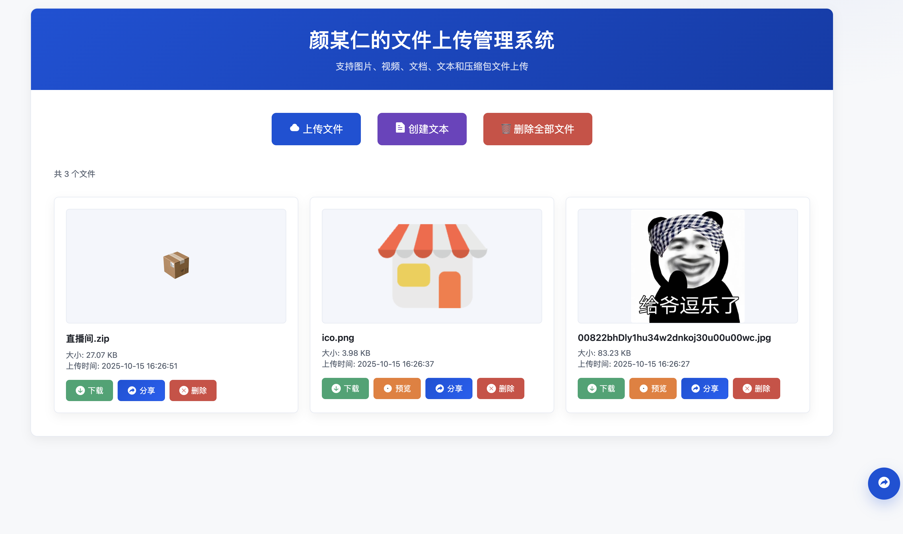
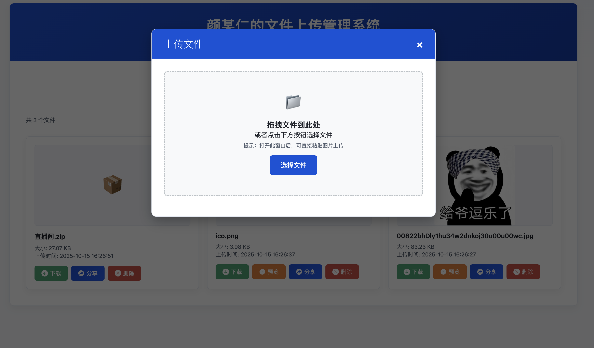
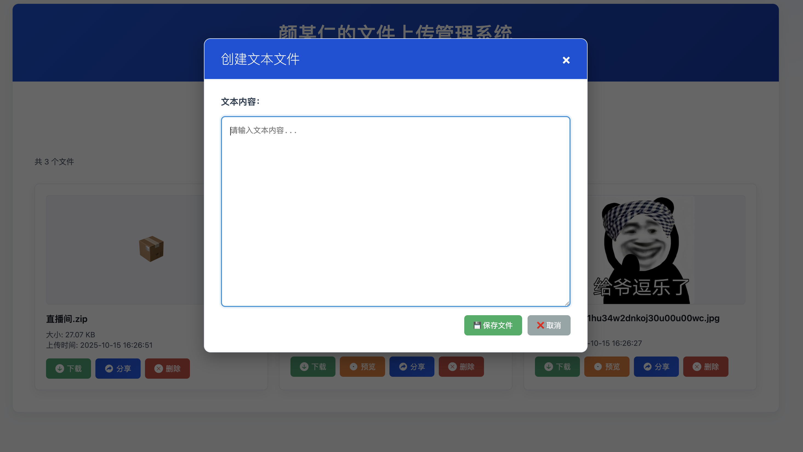

# PHP 文件上传系统-网盘使用

## 项目概述

一个用于临时文件传输的简单后端网盘，支持图片、视频、文档、文本、压缩包等类型文件上传，并支持在浏览器中通过拖拽或复制粘贴图片进行上传。

## 功能特性

- 简单易用：开箱即用，仅依赖原生 PHP
- 多种上传方式：表单上传、拖拽上传、图片粘贴上传
- 类型广泛：图片/视频/文档/文本/压缩包等
- 返回 JSON：便于前端集成与自动化对接
- 可配置：上传目录、大小限制、允许的文件类型（示例见下）

## 环境要求

- PHP 7.4 及以上
- Web 服务器（PHP 内置服务器、Nginx、Apache 均可）

### PHP 扩展（推荐）

- ext-json
- ext-mbstring
- ext-openssl
- ext-pdo
- ext-pdo_mysql
- ext-curl

## 快速开始

1. 克隆项目到本地：
   ```bash
   git clone <项目仓库地址>
   ```

2. （可选）安装依赖：
   ```bash
   composer install
   ```

3. 启动内置服务器（开发/试用）：
   ```bash
   php -S localhost:8000
   ```

4. 访问并测试上传接口：
   - 浏览器访问或前端表单指向 `file_upload.php`
   - 也可通过命令行进行测试（见下文 CURL 示例）

## 配置说明（示例）

在 `file_upload.php` 中通常可配置如下参数（示例字段，具体以代码为准）：

- 上传目录：如 `uploads/`（需确保目录存在且可写）
- 最大文件大小：例如 10MB
- 允许的 MIME/扩展名白名单：如 `jpg, png, gif, pdf, zip`

若部署到生产环境，建议将上传目录放置到 Web 根目录之外，并通过应用生成可访问的下载/预览链接。

## API 使用说明

- 接口地址：`POST /file_upload.php`
- 表单字段：
  - `file`：文件字段（multipart/form-data）
- 返回值：JSON（示例）

```json
{
  "success": true,
  "filename": "example.png",
  "url": "/uploads/example.png",
  "size": 123456
}
```

### CURL 示例

```bash
curl -X POST \
  -F "file=@/path/to/local/file.png" \
  http://localhost:8000/file_upload.php
```

### 浏览器使用

- 表单选择文件上传
- 将文件直接拖拽到上传区域
- 在输入区域粘贴图片（剪贴板中含有图片数据时）

## 预览图片

以下是项目的预览图片：





## 部署建议

- Nginx/Apache 请将 `file_upload.php` 映射为可访问路径
- 限制上传大小：在服务器与 PHP 配置中同步限制
  - `php.ini`：`upload_max_filesize`、`post_max_size`、`max_file_uploads`
  - Nginx：`client_max_body_size`
- 将上传目录设置为不可执行（如 `noexec` 挂载或 Web 服务器层禁止执行）

## 安全与合规建议

- 对文件名进行规范化处理，避免目录穿越与脚本执行风险
- 校验 MIME 类型与扩展名白名单
- 为用户展示的下载链接设置有效期/鉴权（如有需要）
- 对上传图片进行基本清洗（如 strip metadata）以降低隐私风险

## 常见问题（FAQ）

- 无法写入上传目录：请检查上传目录是否存在且具备可写权限（如 `chmod 755/775/777` 依据场景而定）
- 返回 413/请求体过大：请同步调整 Nginx/Apache 与 PHP 的上传大小限制
- 返回 JSON 编码异常：确认已启用 `ext-json` 扩展

